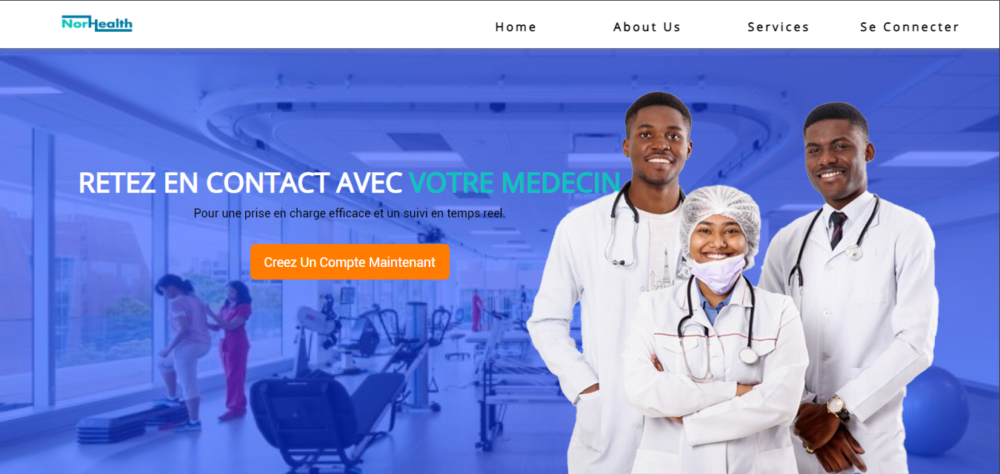
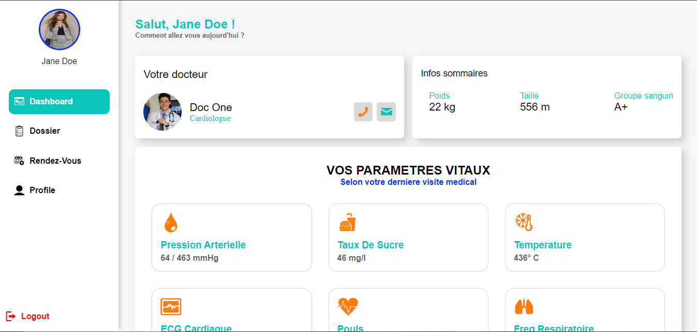
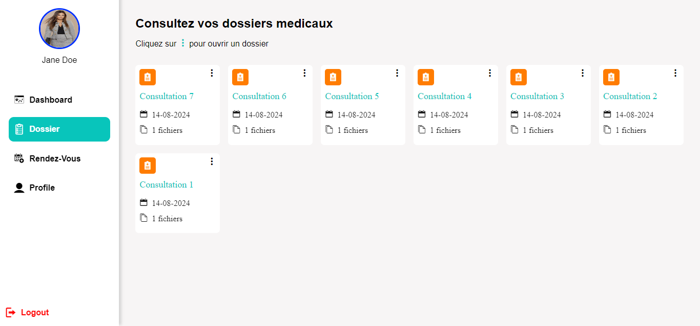
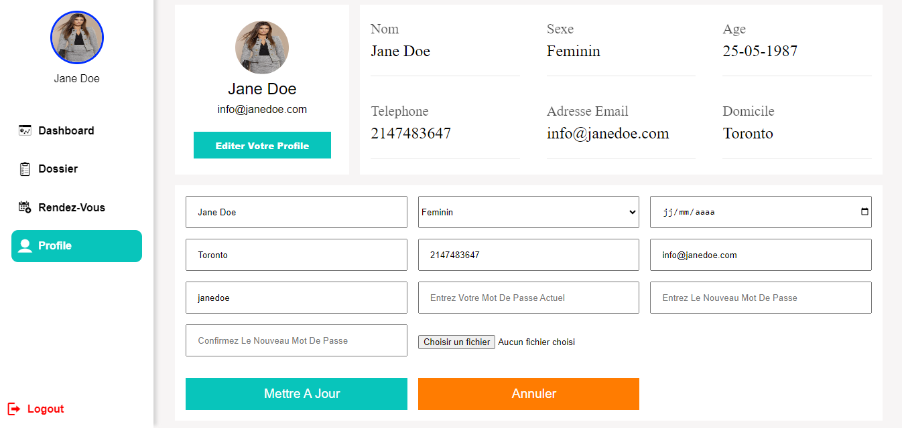

# Application Web de Suivi des Patients

## Description du Projet
Ce projet est une application web de suivi des patients développée en PHP. Il a été réalisé dans le cadre de l'obtention du Baccalauréat en Technologie de l'Information (TI) après un stage au service informatique de l'Hôpital Protestant de Ngaoundéré (également appelé Hôpital Norvégien).

## Fonctionnalités Principales
- **Suivi des Patients** : Les docteurs peuvent ajouter les informations de consultation de leurs patients et ajouter des fichiers comme les documents d’échographie, de radiographie, etc.
- **Gestion des Rendez-vous** : Planifier, modifier et annuler des rendez-vous.
- **Gestion des Utilisateurs** : Ajouter et gérer les utilisateurs du système (receptionnistes, médecins, etc.).
- **Statistiques** : Affichage des statistiques sur les patients et les rendez-vous.

## Technologies Utilisées
- **Langage de Programmation** : PHP
- **Base de Données** : MySQL
- **Frontend** : HTML, CSS, JavaScript
- **Serveur Web** : Apache

## Structure du Projet
- `index.php` : Page d'accueil de l'application.
- `auto/` :  Dossier contenant les fichiers des requêtes vers la base de données, comme le fichier config.php ou ceux de la sélection des utilisateurs (patients, réceptionnistes, etc.).
- `config.php` : Fichier de configuration de la base de données.
- `espace_admin/` :  Dossier contenant les fichiers relatifs à l’espace d’administration.
- `espace_docteur/` : Dossier contenant les fichiers relatifs à l’espace des docteurs.
- `espace_patient/` : Dossier contenant les fichiers relatifs à l’espace des patients, pour la selection des docteurs, la prise des rendez-vous, etc.
- `espace_receptionniste/` : Dossier contenant les fichiers relatifs à l’espace des réceptionnistes.
- `assets/` : Dossier contenant les fichiers css, js et police partages entre plusieurs pages.
- `images/` : Dossier contenant les images utilisées dans l'application.

## Captures d'écran
Quelques images de l'interface sont disponible dans images/captures/ :

## Auteur
- **Abdoul-Bassit Djafarou** - Développeur Principal

## Remerciements
Un grand merci à l'équipe du service informatique de l'Hôpital Protestant de Ngaoundéré pour leur soutien et leurs conseils tout au long de ce projet.

---

Pour toute question ou suggestion, n'hésitez pas à me contacter à abdoulbassitdj@gmail.com.

